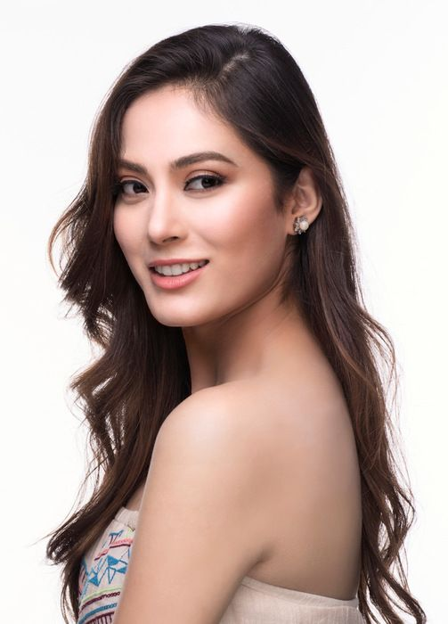

## This project took lots of effort. Don't forget to tap `STAR`⭐ on top-right corner.

# IMAGE TO PENCIL SKETCH USING PYTHON - OpenCV

## `Abstract :` 

This project is based on Image Manipulation using Python Library known as OpenCV i.e. Open Computer Vision. OpenCV-Python is a library of Python bindings designed to solve computer vision problems.

   ### `STEPS`:
      
      1) Importing Libraries cv2 & matplotlib.pyplot
      2) Loading Original Image.
      3) Converting BGR into Gray Scale Image.
      4) Inverting Gray Scaled Image.
      5) Bluring Inverted Image.
      6) Inverting Blurred Image.
      7) Generating Pencil Sketch Image.
      8) Saving and loading image.
      9) Visualization  in a Single Frame
 

### `Image used for sketch in this project :`

It is of Shrinkhala Khatiwada who is a Nepalese model and Miss Nepal World 2018.
She represented Nepal in Miss World 2018.
    

  

## Uploaded Presentation video of this on my YOUTUBE CHANNEL --> 64bitCODING

videolink --> will be uploaded soon.

## Please DO VISIT and HIT LIKE 👍 and SUSCRIBE 🔔 BUTTON.
### Your one LIKE 👍 gives us MOTIVATION.

### CONTACT ME ON:

linkedin --> https://www.linkedin.com/in/abhishek-thapa-b9a733199/
